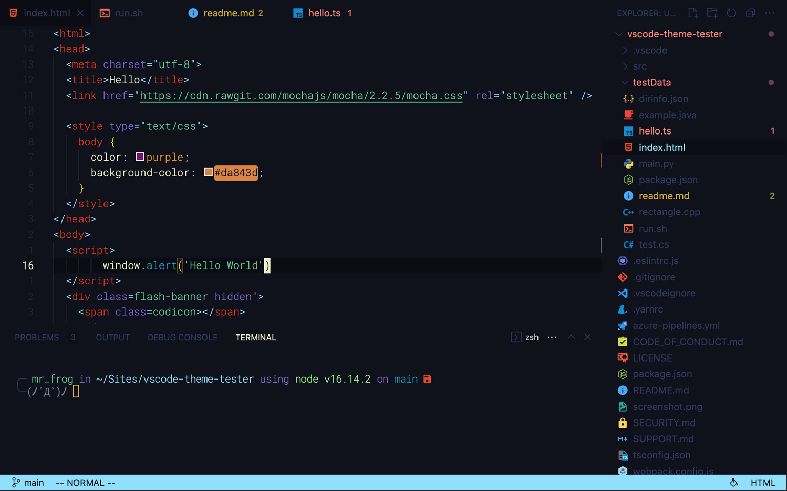

# Material Space Duck Theme

> The VS Code theme you need, ducks in space!

VS Code theme inspired by Space Duck  [pineapplegiant/spaceduck](https://github.com/pineapplegiant/spaceduck) and Material Theme [material-theme/vsc-material-theme](https://github.com/material-theme/vsc-material-theme).



## Install

1. Open VSCode
2. Open the extensions tab `CMD + SHIFT + X`
3. Search for "space duck" and hit install.

## Code Examples

Markdown


Bash


ReactJS


## Extra

### My settings

If you like my look you can open your `settings.json` and add:

```JSON
{
  ...
  "window.zoomLevel": 1,
  "editor.fontSize": 14,
  "editor.scrollbar.horizontal": "hidden",
  "editor.scrollbar.vertical": "hidden",

  "terminal.integrated.fontWeight": "100",
  "terminal.integrated.cursorBlinking": true,
  "terminal.integrated.letterSpacing": -1,
  ...
}
```

I use a modified version of Roboto Mono called [Roboto Mono Nerd Font](https://github.com/ryanoasis/nerd-fonts/blob/master/patched-fonts/RobotoMono/Regular/complete/Roboto%20Mono%20Nerd%20Font%20Complete.ttf) to allow nerd icons in my terminal.

```JSON
{
  ...
  "editor.fontFamily": "RobotoMono Nerd Font",
  ···
}
```

I also use [ Vim ](https://marketplace.visualstudio.com/items?itemName=vscodevim.vim) and I let my statusbar change colors depending on the current mode, use this to match the theme colors:

```JSON
{
  ...
  "vim.searchHighlightColor": "#8cdefd",
  "vim.searchHighlightTextColor": "#0f111a",
  "vim.statusBarColorControl": true,
  "vim.statusBarColors.commandlineinprogress": "#00a3cc",
  "vim.statusBarColors.easymotioninputmode": "#00a3cc",
  "vim.statusBarColors.easymotionmode": "#00a3cc",
  "vim.statusBarColors.insert": ["#e33400", "#0f111a"],
  "vim.statusBarColors.normal": ["#8cdefd", "#0f111a"],
  "vim.statusBarColors.replace": "#f2ce00",
  "vim.statusBarColors.searchinprogressmode": "#00a3cc",
  "vim.statusBarColors.surroundinputmode": "#00a3cc",
  "vim.statusBarColors.visual": ["#7a5ccc", "#0f111a"],
  "vim.statusBarColors.visualblock": ["#A3BE8C", "#0f111a"],
  "vim.statusBarColors.visualline": ["#7a5ccc", "#0f111a"],
  ...
}
```